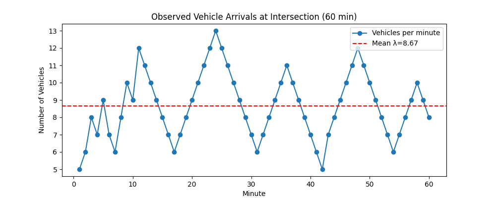

# Traffic-flow-Driver-Behavioural-Model
# Python for Traffic Flow Analysis 🚦

This project provides a simple yet powerful Python script to model and visualize three fundamental concepts in traffic engineering. It serves as an educational tool for understanding traffic dynamics, from individual vehicle arrivals to macroscopic traffic flow.

## Key Concepts Demonstrated

1.  **Stochastic Arrivals:** Simulates the random arrival of vehicles at an intersection and calculates the average arrival rate (**λ**).
2.  **Queueing Theory (M/M/1 Model):** Analyzes the performance of a traffic signal by modeling it as a single-server queue. It calculates key metrics like signal utilization (**ρ**), average queue length (**Lq**), and average waiting time (**Wq**).
3.  **Macroscopic Traffic Flow (Greenshields Model):** Models the relationship between traffic **Speed**, **Density**, and **Flow** on a road segment, visualized through the Fundamental Diagram of traffic.

## Visualizations

The script generates the following plots to help visualize the traffic models:

**1. Vehicle Arrivals Over Time**


**2. Fundamental Diagrams of Traffic Flow**


*(Note: To generate these images, run the script and save the plots from the windows that pop up. Create an `images` folder in your project to store them.)*

## Getting Started

Follow these instructions to get a copy of the project up and running on your local machine.

### Prerequisites

* Python 3.8 or newer
* pip (Python package installer)

### Installation

1.  **Clone the repository:**
    ```bash
    git clone [https://github.com/YOUR_USERNAME/YOUR_REPOSITORY_NAME.git](https://github.com/YOUR_USERNAME/YOUR_REPOSITORY_NAME.git)
    cd YOUR_REPOSITORY_NAME
    ```

2.  **Install the required packages:**
    ```bash
    pip install -r requirements.txt
    ```

## Usage

To run the simulation and generate the plots, simply execute the main script from your terminal:

```bash
python traffic_model.py
